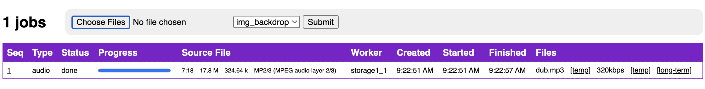
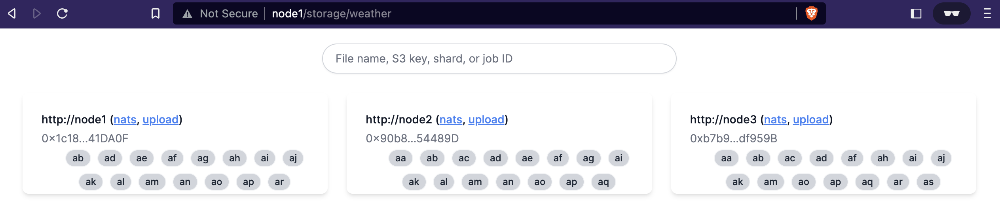

# Storage V2 :package:

Storage V2 is responsible for the transcoding, even distribution and retrieval of user supplied content.

> This project values simplicity in all areas of design.

**Features**
- [Replicated Sharding](#replicated-sharding)
- [A Transcoding Pipeline](#transcoding)
- [Configurable Blob Storage](#blob-storage)
- [Backup and Restore Tooling](#backup-and-restore)
- [Content Access Control](#access-control)
- [An HTTP API](#http-api)

---

## Quickstart

To get started with a lightweight multi node cluster and test uploads.

<sub>The upload dashboard</sub>


**BUILD AND RUN**

(from the comms/ directory with the Makefile - one level up from here)
```shell
# on the first run, make will password prompt
# to add a single required route to /etc/hosts
make

# then you can visit the web ui to test uploads
open http://node1/storage

# you can also curl uploads
curl -F "files=@/path/to/file.wav" -F "template=audio" http://node1/storage/file

# after some uploads, you can see which nodes stored what files 
docker logs storage1 2>&1 | grep -i storing

# to check nats stream status
docker exec -ti nats1 nats stream ls -a

# explore the weathermap for a visual layout of the sharded filesystem
open http://node1/storage/weather

# tail logs to see hot reloading
docker logs -f storage1

# now change some go files...
...
  storage/storageserver/storageserver.go has changed
  building...
  running...
```

# teardown
`make down`

---

# Features

### Replicated Sharding

<i>TODO: Docs</i>

[Rendezvous hashing](https://en.wikipedia.org/wiki/Rendezvous_hashing) is used to ensure all nodes in the network agree on **who** should store **what** data.

### Visibility

For visibility and troubleshooting, a storage weathermap at `/storage/weather` provides visualization and introspection into the location of files within the network. As well as each node's view of the hash ring.

<sub>The storage weathermap</sub>


For weathermap **development** workflow see [./storageserver/weather-map/README.md](./storageserver/weather-map/README.md)

### Transcoding

<i>TODO: Docs</i>

An integrated normalization pipeline exists to encode input audio and image files into nominal output formats and compression ratios.

### Blob Storage

The system uses [blob storage](https://gocloud.dev/howto/blob/) to abstract a file system interface across local storage and cloud storage setups.

**Storage Location**

The default storage driver url is `file:///tmp/audius_storage`.
This is the directory on your node where files will stored post transcoding.

To update the local storage location set the `storage_driver_url` environment variable

```shell
storage_driver_url="file:///my/directory"
```

**Cloud Storage**

To use cloud object storage instead of local storage, you will need to:

- create either an s3 bucket, gcs bucket or azure storage container
- your bucket access policy must <u>NOT BE PUBLIC</u>
- provision credentials that allow access to your bucket

[S3 storage](https://aws.amazon.com/s3/)
```shell
AWS_ACCESS_KEY_ID="<my-access-key-id>"
AWS_SECRET_ACCESS_KEY="<my-secret-access-key>"
storage_driver_url="s3://my-bucket?region=us-west-1"
```

[GCS storage](https://cloud.google.com/storage/docs/creating-buckets)
```shell
GOOGLE_APPLICATION_CREDENTIALS=""
storage_driver_url="gcs://my-bucket"
```

[Azure storage](https://azure.microsoft.com/en-us/products/storage/blobs)
```shell
AZURE_STORAGE_ACCOUNT=""
AZURE_STORAGE_KEY=""
storage_driver_url="azblob://my-container"
```

### Backup and Restore

Tooling exists to allow a node operator to backup and restore their storage node data.

```shell
# the below is illustrative and is in active development
docker run audius/storage-archiver -e "MODE=BACKUP"  -e "<AUTHORIZATION>" -e "<BUCKET_NAME>" -d
docker run audius/storage-archiver -e "MODE=RESTORE" -e "<AUTHORIZATION>" -e "<BUCKET_NAME>" -d
```

### Access Control

<i>TODO: Docs</i>
Signature validation. Compliance.

### NATS Gateway

<i>TODO: Docs</i>
The project uses [NATS](https://nats.io) as a connective substrate between nodes.

### HTTP API

An HTTP API exists to allow clients to inteface with storage v2.

```shell
# TODO: Docs
POST /file
GET  /jobs
GET  /jobs/:id
GET  /tmp-obj/:bucket/:key
GET  /long-term/shard/:shard
GET  /long-term/file/:fileName
GET  /job-results/:id
```

**POST /file**

<i>Example: Upload a track</i>

```shell
curl -F "files=@/path/to/file.wav" -F "template=audio" http://node1/storage/file

[
  {
    "id": "cle4h8b1g000101q8l4tz2mkx",
    "template": "audio",
    "status": "pending",
    "created_at": "2023-02-14T16:46:44.66288267Z",
    "source_info": {
      "name": "cle4h8b1g000101q8l4tz2mkx",
      "description": "dub.mp3",
      "options": {
        "max_chunk_size": 131072
      },
      "bucket": "temp_14",
      "nuid": "yAyElmI9R40Zjuqp7YuGgg",
      "size": 17804422,
      "mtime": "2023-02-14T16:46:44.66287517Z",
      "chunks": 136,
      "digest": "SHA-256=JxJGxEhuS7Gp9qnCRhs_CCYpHWZ7cL5HzeP0sPje0Iw="
    }
  }
]
```

---

# License

Distributed under the Apache Version 2.0 license found in the [LICENSE](../../LICENSE) file
