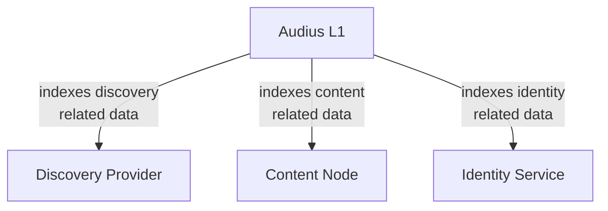

# audius core

The distributed event log that binds discovery, content, and identity together. The audius L1.

## architecture

Built with cometbft, audius core is the L1 blockchain that stores all the canon events in the audius protocol. The core is the library that allows you to build node types around this source, publish events, index data, and materialize views that then power audius applications.



## configuration

Whether running as an independent image or embedded, core requires some environment variables to run.

### local cluster

### running in production


## testing

To run tests simply run the make command. This will run both unit and integration tests.

```bash
make test
```

### unit tests

Place unit tests next to appropriate files in the standard go fashion

```bash
core/signature.go
core/signature_test.go
```

### integration tests

Integration tests are written with [ginkgo](https://github.com/onsi/ginkgo) and [gomega](https://github.com/onsi/gomega) to be more readable, the way to generate one is to use the ginkgo cli installed in the `make deps` command.

```bash
ginkgo generate NewTestName
```
