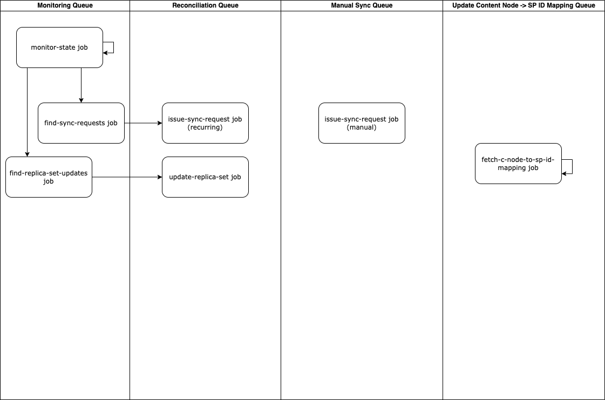

# State Machine Manager

Collection of services to search for state anomalies (out of sync data or other issues caused by unhealthy nodes) and fix them.

## Queues and Jobs

Edit diagram [here](https://viewer.diagrams.net/?tags=%7B%7D&highlight=0000ff&edit=_blank&layers=1&nav=1&title=StateMachineDemo.drawio#R7Vpdk5s2FP01nmkf6IBkA37MOps0nWwnrdsm6UtHCzJoV0hEiNjk11eA%2BDK28W7Wxu3uyy66%2BuSew7lXkidwEW3eChSHN9zHdAJMfzOBrycAWABO1b%2FckpUWF9ilIRDE140aw5J8w9poamtKfJx0GkrOqSRx1%2BhxxrAnOzYkBF93m6047c4aowD3DEsP0b71I%2FFlqK2WaTYVP2MShHpqd6YrbpF3HwieMj0f4wyXNRGqhtFNkxD5fN0ywesJXAjOZfkUbRaY5m6tPFb2e7Ontl6ywEwe08FxsO3NnZU1t33kutDQI3xFNNVu0AuVWeWXZE0iitQrwatQRlQZLfXohYT671HG03ziRCofVKUrVRJSA2yqcuEb7OtS7YO8QNEtple1AxeccqGqChfmAwl%2BX6ORT7viTL5BEaE5yf7CwkcMabOe0FVFREnA1LOn3ILVeFd9P1UvjoXEm5ZJ%2B%2B0t5hGWIlNNdK2jIdTsrsBfN1RxK5TDFkucqTYiTc%2BgHrnBST1oqI6EDfRgu%2BGMSC4IC5T9txSn%2BEgg22ABc6ev9rJm2Hkt94DpqdyT3f5BeRAsif0L%2FZv9s3h3f8cNOOs5APvqg9dFLmTIA84QvW6sW0xt2rznPNb%2BusNSZtpfKJW86028IfJT3v0nZ6aLn1tVrzd66KKQVQWmXrjsNauKn9t1TbeiVPVrsd4CNXL5W%2B6Vh31MSngqPLynjavVGIkAywMun%2B7mgMAUSfK1u6inx9seF2%2FwKLzBfxpw5zsBL7q%2BEgJlrQYxJ0wmrZE%2F5IZGiGddIbbAbIs75YANk%2BqVPU5r3R0h0qZSw9FhnP0l5VWFkRRAvVINLBBvCrSqevUU5P%2BjUrQNpcFS6bV5x2%2BrsdUyy%2BHLlj1uN8zNubYOicTLGBWIrlV%2BtqXxFxFy90axo2MwHIzBlr0ryMxOpDnT01FjRZhvJBnzDIG%2FpDjJv4j%2FIT962B9DmWNzNGs%2BNkGcExNE4JgSDxkJlkYa%2B0pFXmgyTBOrSxMwOk2sUXLVEbOJ3W3OkDr2Joa9L%2FR37HHmEUrUzJxd1G5K19Y7qfbuyj3r7grMT6dsJElS3Il9laaZPwjspSLf5f74zBUOHmSIfWmBEPZPLJ6ML2Xga8fClxj4UIacNQb2ltrPo28QS1HeZ6lk4BI1eAb6DoPmeU%2B4TphdHtLgqMDmuQvwnsOuS92JQGuMFLM56eocczXHnCc86KpeuJWaHtrEDx52lSnPaMeb8AW%2Fg3vsQfzgnk3hmfDrHyP%2BWeQtyrZQ3sKFYP%2FK%2FdxgKDFFUS6NWlLN5Qf1553qZd6gOH6yW54B0TscAt354HHcmSMiOGGWucLSCw3PYAoiQ3IjiQ3iG1GNxrNLOA%2FQ%2FOis056NHBaBM4qs6luj6rkU1foGafet0bam1tpcC3U5jDMkzkeI8UEJG1Tk6jMcDqnfK8m7b4jq8xFNM2ht0adcmO7VMOihN1H1zzrqTVTnKmpwXQ9tD7UrHnnVpYrNL03K5s0veeD1vw%3D%3D)

### Monitoring Queue
1. monitor-state job: gathers data for a slice of users and enqueues 3 jobs to:
    1. find users in this slice with out of sync data
    2. find users in this slice with unhealthy nodes that need to be replaced
    3. analyze the next slice of users
2. find-sync-requests job: for each user given, looks for data that is different across the user's 3 replicas and enqueues jobs to issue sync requests that will sync the different data between the nodes
3. find-replica-set-updates job: for each user given, looks for nodes that are deemed unhealthy and enqueues jobs to pick new nodes for the user's replica set

### Reconciliation Queue
1. issue-sync-request job (recurring): issues a request from this node (the user's primary) to one of the user's secondaries. Waits for the user's secondary to process the request and sync data
2. issue-replica-set-update job: replaces one or more of the unhealthy nodes in the user's replica set with healthy nodes and enqueues jobs to sync data to these new nodes

### Manual Sync Queue
Has a single job that works same way as recurring sync jobs in the Reconciliation Queue, but this queue is like a fast lane that only takes syncs triggered by a write (user uploading track, playlist, etc...).

### Update Content Node Endpoint -> SP ID Mapping Queue
Has a single job that runs infrequently to check if any Service Provider IDs have changed on-chain (this rarely happens -- only when a Service Provider joins or leaves the network). Builds a mapping of content_node_endpoint (string) -> service_provider_id (number) that other jobs use.
