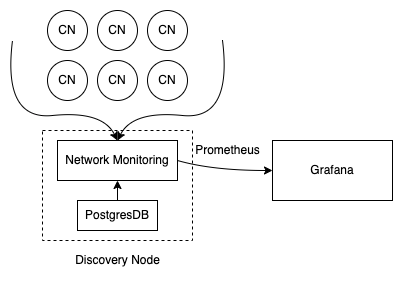

# Audius Network Monitoring

**Network Monitoring** (*formerly known as [KPI Dashboard](https://kpi.audius.co/)*) refers to network-wide metrics we collect from a discovery node and aggregate to assess the health of the entire network.

Note - This is different from node-level metrics which are scraped by prometheus from the content and discovery nodes through a special `/prometheus_metrics` route.

Here are some metrics that we currently track:

- The number of CID on each CN that have been replicated at least once
- The number of CID on each CN that have ***NOT*** been replicated at least once
- [ex 1] **The number of users with a specific CN as their primary**
- The number of users with a specific CN in their replica set
- CID replication across the CNs
- CID replication factor
- The number of users with their data syncs across 0, 1, 2, or 3 CNs

Metrics are collected and calculated on a nightly basis.


## Prereqs

This project assumes an instance of postgres (>`v10`) is running and requires direct access to a Discovery Node postgres DB.


## Running a job

```
npm i
npm start
```

-------------

## Internals

Network Monitoring internally connects directly to the postgres instance running on a discovery node. With the information pulled from the discovery node, information is pulled from every content node to:

1. Verify that the info coming from the discovery node is correct 
2. Make sure user data is getting replicated properly within a user's replica set

Data collected from both the discovery node and content nodes is agggregated and exposed using a [Prometheus Push Gateway](https://prometheus.io/docs/practices/pushing/).



### Database Schema

