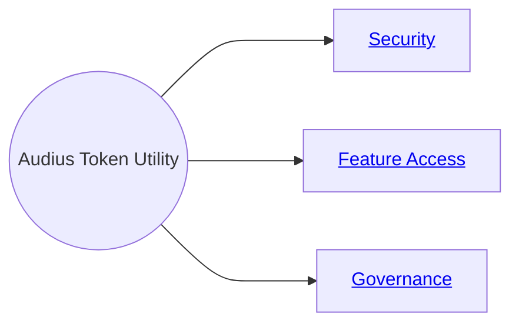

## How it Works

Offering a native token to align all actors creates a parallel incentive unique to web3, and one
which allows our early adopters to share in the upside of Audius as we continue to grow.

The Audius platform token $AUDIO has three prongs of functionality within the Audius protocol
ecosystem:

$AUDIO is staked as collateral for a value-added service such as
[operating a Node](/node-operator/overview) or participating in governance.

In exchange, Stakers earn ongoing issuance, governance weight, and access to exclusive features.

In the future, $AUDIO will govern a global fee pool from value transfers in the network.

---

## Security

$AUDIO is staked by Node Operators to secure the network. The larger the stake, the higher the
probability of their node being used by fans and artists.

Audius is entirely hosted and operated by the community, creating a permissionless ecosystem of Node
Operators securing content for the world’s unstoppable streaming protocol.

---

## Feature Access

$AUDIO serves as collateral to unlock additional artist tooling. Early examples incubated by the
community include artists tokens, badges, and earnings multipliers.

In the future, Fans may delegate $AUDIO to specific Artists and curators to share in their growth on
the platform.

---

## Governance

Staking $AUDIO gives users governance weight to influence the future of the protocol, with each
token staked equaling one vote.

Every aspect of Audius is governable, aiming to involve even passive fans to voice their opinion
over product updates and feature upgrades.

Ongoing issuance aligns power with the most active platform users, ensuring $AUDIO tokens are always
being funneled to value-added actors. This distribution method, using on-chain metrics, directs
issuance to active participants, rather than just the largest stakers.
