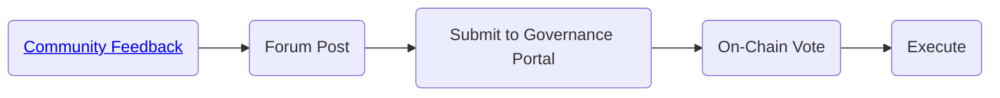

# Governance

## How Audius Governance Works

Governance is the process by which AUDIO token holders enact change to Audius through on-chain
proposals.

It allows the community to directly shape future iterations of the platform and is the core
principle driving Audius’s decentralized infrastructure.

In this post, we’ll cover how governance works in Audius, and what you can do as an AUDIO holder to
get involved.

## Governance Portal

The single source of truth for Audius governance can be found in the protocol dashboard under the
[Governance tab](https://dashboard.audius.org/#/governance).

Here you can see a list of all Active and Resolved proposals in chronological order along with
whether they have passed or failed.

Every governance proposal comes with a breakdown of the following parameters:

| Parameter   | Description                                               |
| ----------- | --------------------------------------------------------- |
| Proposer    | The address responsible for submitting the proposal       |
| Description | A quick synthesis of what the governance proposal entails |
| For         | The amount of votes in favor of the proposal              |
| Against     | The amount of votes against the proposal                  |

> All proposals are subject to 5% of staked $AUDIO quorum and 50% majority.

This means that for a proposal to pass, at least 5% of all staked $AUDIO must vote on the proposal
and more than 50% of the votes must be ‘For’ the proposal.

Today, only those running a node may make a proposal on-chain. In future, the set of permitted
proposers could be expanded in any way the community sees fit.

## Governance Process

Effective governance is much more than voting on proposals on-chain, and something that we want to
make even more accessible at Audius.

Here’s a breakdown of Audius’s evolving governance ecosystem, including the tools, processes and
logistics behind AUDIO voting.

Please note that some users may be more inclined than others to facilitate the duration of this
process, and we recommend anyone interested in shaping Audius to contribute in whatever ways
possible, even if that means just starting a conversation around a topic on Discord!

### Governance Discord

In the [AUDIOphile Discord](https://discord.gg/audius), you’ll notice a channel called \#governance.
This is where early iterations and ideas for proposals can be submitted for community feedback.

Getting feedback on a proposal in Discord is not required, but a great way to get a general feeling
of whether or not a topic is worth fleshing out in detail prior to submitting on the forum for a
more formal discussion.

Governance topics can be seen as a means of signalling, where proposers receive very high level
feedback from other community members to see whether or not their ideas will be received well in
principle.

### Governance Portal

After receiving feedback, node operators can submit that proposal on-chain through the Governance
portal.

Please note that proposition power is correlated to the amount of AUDIO staked or delegated for
network security, meaning node operators are the primary candidates for on-chain proposals.

A list of all on-chain proposals can be found [here](https://dashboard.audius.org/#/governance).

The details of the proposal should map to the specifications outlined in the forum post, including
details and implementations around any technical changes required for the proposal to be
implemented.

### On-chain Voting

Using Figment’s
[most recent governance proposal](https://dashboard.audius.org/#/governance/proposal/9) as an
example, you can see that different node operators and delegators voted in favor of extending the
voting time from 48 to 72 hours.

Given that the total number of votes \(1 AUDIO, 1 vote\) was above the quorum requirement of ~11M
$AUDIO and the 50% majority \(100% voted in favor\) the proposal passed!

In doing so, the changes
[from this proposal](https://etherscan.io/tx/0xd4e14895b2a22b48469a43923ab7b30bee75f9a688941933430b3dae9510b8a6)
were
[executed through the governance contract](https://etherscan.io/tx/0x4396652fb9c1116cec5900f412608dfba7a3ec1b9967f4109a8ec3e09d3a75af),
changing the voting window from 48 hours to 72 hours!

### Community Multisig

Once a vote has been passed, the governance contract executes the proposal.

However, Audius also features a community multisig as a veto of last resort, referenced in the
whitepaper in the “short-circuiting” subsection of the governance section.

This means that a set of 9 Audius community members have the ability to stop a malicious proposal
from passing. In the event the multisig is used, 6 of the 9 signers must sign a transaction to
nullify the proposal.

As Audius continues to mature, the community can at any time vote to remove this veto ability from
the system as well.

More details on the signers of this multisig as well as the intent for its use will be shared in a
future blog post.

## Evolving Governance

Audius governance is an evolving process geared at giving all $AUDIO holders a voice of future
iterations of the platform.

The process detailed above is likely to change in line with new tools, product upgrades and onramps
to allow for all token users to easily review and participate in governance decisions, regardless of
their technical knowledge.

We’re excited to share more details around governance in the near future and look forward to
building out the community-owned streaming protocol that is Audius!
