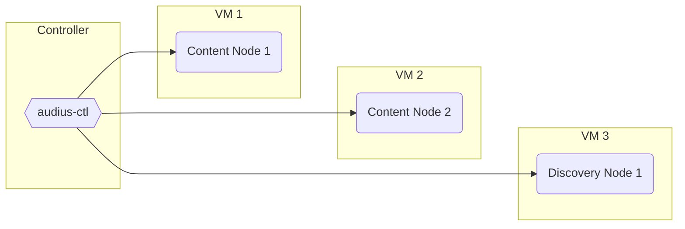
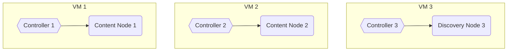
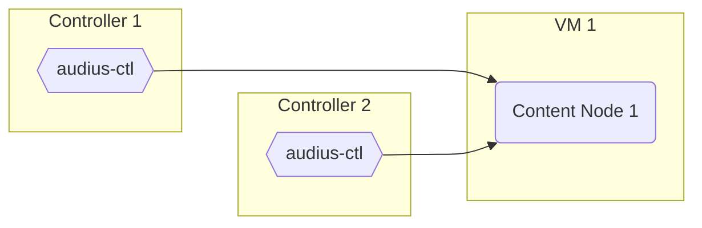

import useBaseUrl from '@docusaurus/useBaseUrl'
import Tabs from '@theme/Tabs'
import TabItem from '@theme/TabItem'

## Controllers and Nodes

A key feature of `audius-ctl` is the usage of configuration profiles to interact with and control
multiple Nodes from a single "Controller" over ssh.

Node Operators are able to manage all of their Nodes, or a subset of their Nodes, from a single
command line utility, rather than needing to access each Node directly to issue commands

Any computer or virtual machine can be a Controller, a laptop, a shared Virtual Private Server for
your team, or even the host machine running a Node itself. Only one Controller is needed, but Node
Operators can configure as many Controllers as they would like to suit their needs.

---

## Suggested Configuration

While it is recommended to use an additional machine as a Controller, but remember _any_ machine can
operate as a Controller.

> This example is a simple configuration where the Node Operator has configured one host machine as
> a Controller and uses it to access and mange a set of Nodes.



---

### Controller on Host

In this configuration, the Node Operator configures each host machine to run a Node and its own
Controller.

In this example, the Node Operator has elected to use the machine marked `VM 1` to both run a Node
_and_ serve as the Controller for `VM 1`, and the same for each of `VM 2` and `VM 3`.

> This configuration can be useful for Node Operators looking to isolate Nodes from one another and
> reduce the security concerns that may arise from configuring multiple ssh access options.



To running `audius-ctl` and a Node on the same host first follow the
[audius-d config instructions](/node-operator/migration-guide/#5-edit-the-configuration-file) and
then edit your `/etc/hosts` file to map `localhost` to the Node URL

```bash showLineNumbers title="/etc/hosts file"
#/etc/hosts
127.0.0.1    content-1.example.com
    │                └── # THE URL OF THE NODE
    └── local host
```

---

### Multiple Controllers

In this configuration, a single Node is accessible from two different hosts acting as Controllers.

> This configuration can be useful when distributing access control to multiple users.



### Using a Virtual Private Server

Keep private keys secure by requiring users interacting with Nodes to log in to a Virtual Private
Server and issue commands from `audius-ctl` there.

> This configuration can be useful from a security and gatekeeping perspective, narrowing the access
> point to a single access machine which can be managed by multiple users.


---

## Downing a Node

If for some reason you want to `down` an Audius Node, use the following command:

```bash
audius-ctl down
```

:::warning All together now

This command will down **ALL** of the Audius Nodes specified in the configuration. To down a single
node, pass the URL as an additional argument, like this:

```bash
audius-ctl down content-1.example.com
```

The same can be done with the `up` command when you are ready to start the Audius Node again.

:::

---

## Content Node Storage Configuration

Content nodes support s3 compatible blob storage as an alternative to SSD storage.

Enter your information into each field for each Audius Content Node you will be running.

<Tabs
  block={true}
  defaultValue="aws"
  values={[
    { label: 'AWS', value: 'aws' },
    { label: 'Azure', value: 'azure' },
    { label: 'Google Cloud', value: 'gcp' },
  ]}
>
<TabItem value="aws">

```bash showLineNumbers title="audius-ctl configuration file with AWS storage config"
network:
  deployOn: mainnet
nodes:
  content-1.example.com:        # <--- THE URL OF YOUR CONTENT NODE
    type: content
    privateKey: abc123          # <--- UNIQUE PRIV KEY USED BY THIS NODE TO SIGN RESPONSES
    wallet: 0xABC123            # <--- UNIQUE WALLET ADDRESS OF ABOVE PRIV KEY
    rewardsWallet: 0xABC123     # <--- ADDRESS OF WALLET HOLDING STAKED TOKENS
    storage:
      storageUrl: s3://my-s3-bucket
      awsAccessKeyId: abc123
      awsSecretAccessKey: 321cba
      awsRegion: us-west-2
```

</TabItem>

<TabItem value="azure">

```bash showLineNumbers title="audius-ctl configuration file with Azure storage config"
network:
  deployOn: mainnet
nodes:
  content-1.example.com:        # <--- THE URL OF YOUR CONTENT NODE
    type: content
    privateKey: abc123          # <--- UNIQUE PRIV KEY USED BY THIS NODE TO SIGN RESPONSES
    wallet: 0xABC123            # <--- UNIQUE WALLET ADDRESS OF ABOVE PRIV KEY
    rewardsWallet: 0xABC123     # <--- ADDRESS OF WALLET HOLDING STAKED TOKENS
    storage:
      storageUrl: azblob://my-az-blob
      azureStorageAccount: abc123
      azureStorageKey: abc123
```

</TabItem>

<TabItem value="gcp">

```bash showLineNumbers title="audius-ctl configuration file with GCP storage config"
network:
  deployOn: mainnet
nodes:
  content-1.example.com:        # <--- THE URL OF YOUR CONTENT NODE
    type: content
    privateKey: abc123          # <--- UNIQUE PRIV KEY USED BY THIS NODE TO SIGN RESPONSES
    wallet: 0xABC123            # <--- UNIQUE WALLET ADDRESS OF ABOVE PRIV KEY
    rewardsWallet: 0xABC123     # <--- ADDRESS OF WALLET HOLDING STAKED TOKENS
    storage:
      storageUrl: gs://my-gs-blob
      googleApplicationCredentials: google-application-credentials.json # See Note below
```

:::tip file location

For GCP configurations, the `google-application-credentials.json` file **MUST** be stored under
`/var/k8s/mediorum` on the host machine.

:::

</TabItem>

</Tabs>
