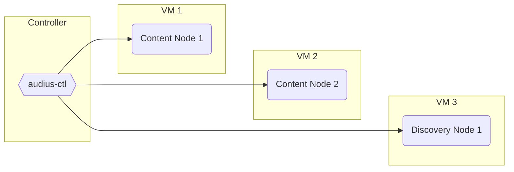
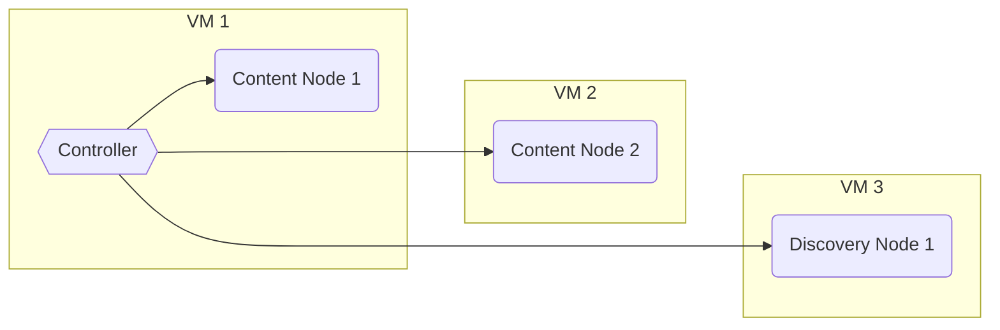
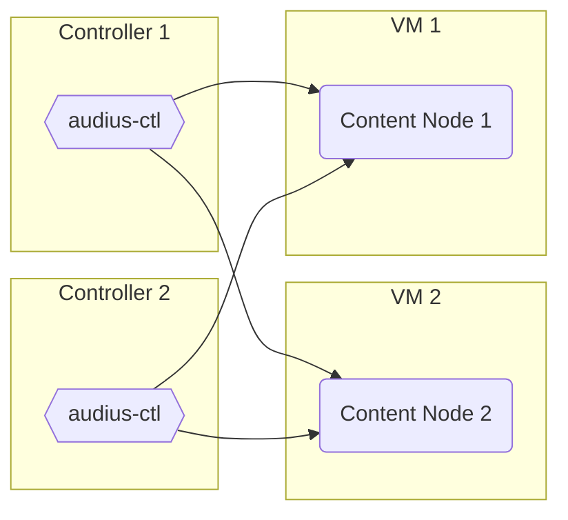
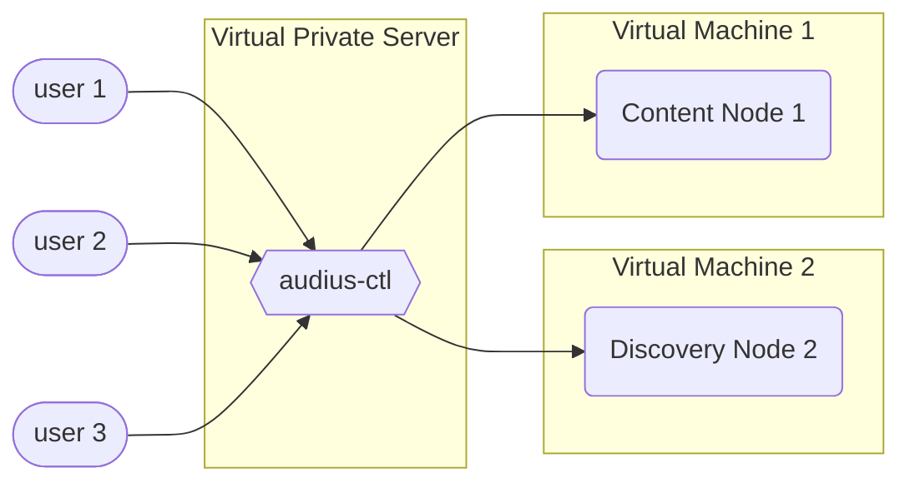

import useBaseUrl from '@docusaurus/useBaseUrl'

## Controllers and Nodes

A key feature of `audius-ctl` is the ability to interact with and control multiple Nodes from a
single "Controller". Any computer or virtual machine can be a Controller, a laptop, a shared Virtual
Private Server for your team, or even the VM running a Node itself. Only one Controller is needed,
but Node Operators can configure as many Controllers as they would like.

Node Operators manage all of their Nodes, or a subset of their Nodes, from a single command line
utility. Rather than needing to access each Node directly to issue commands, a single "controller"
machine, using configuration profiles, is able to issue commands to several Nodes over ssh.

### Audius Control Utility

Installing and configuring `audius-ctl` on the Controller includes the command line utility
`audius-ctl`

### Suggested Configuration



:::tip Flexible Options

While it is recommended to use an additional machine as a controller, _any_ machine can operate as a
controller.

:::

### Controller on Node

In this example, this Service Provider has elected to use the machine marked `VM 1` to both run a
node _and_ serve as the controller for all of their other nodes.



### Multiple Controllers

description text goes here



### Using a Virtual Private Server

Keep private keys secure by requiring users interacting with Audius Nodes to log in to a Virtual
Private Server and issue commands from `audius-ctl` there.



---

### Downing a Node

If for some reason you want to `down` an Audius Node, use the following command:

```bash
audius-ctl down
```

:::warning All together now

This command will down **ALL** of the Audius Nodes specified in the configuration. To down a single
node, pass the URL as an additional argument, like this:

```bash
audius-ctl down content-1.example.com
```

The same can be done with the `up` command when you are ready to start the Audius Node again.

:::
