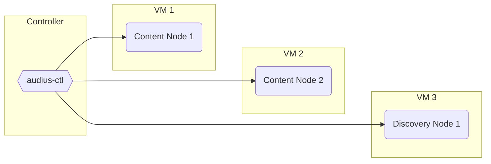
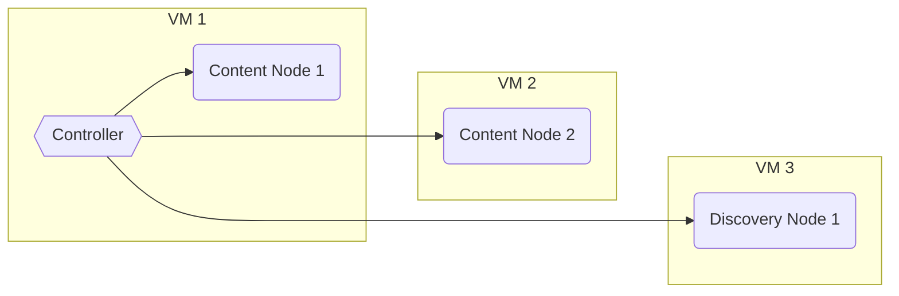
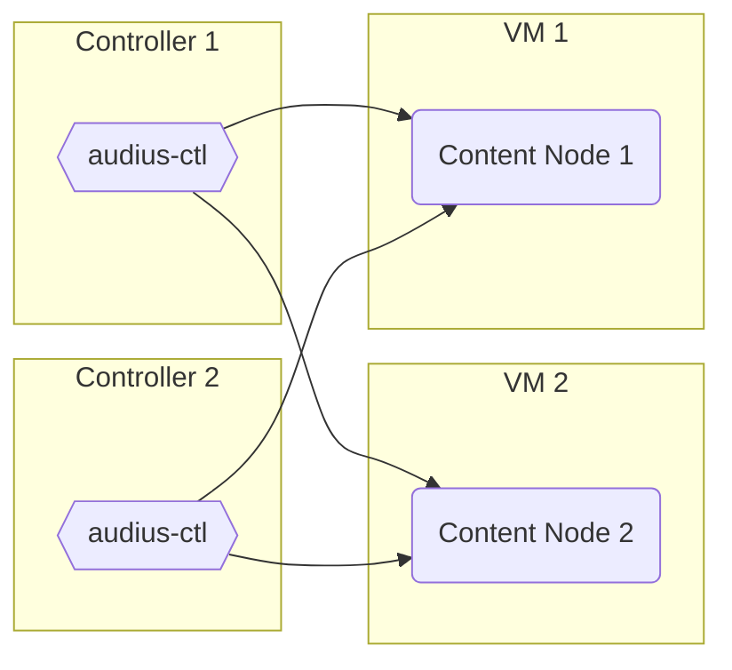
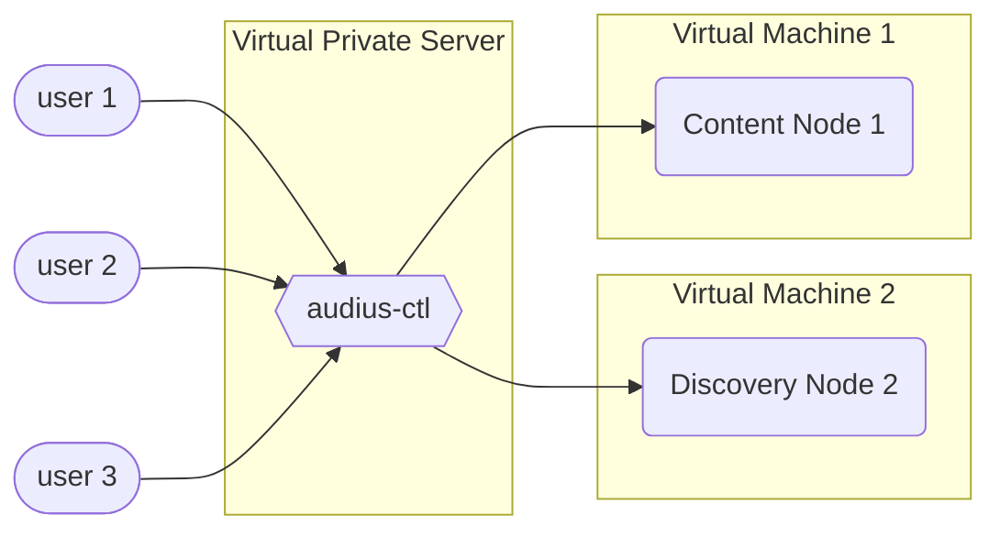

import useBaseUrl from '@docusaurus/useBaseUrl'

:::caution Looking for Audius-Docker-Compose?

Please be aware that `audius-docker-compose` will soon no longer be supported.

New Nodes and new Node Operators should use `audius-d`.

Existing Node Operators should migrate to `audius-d`, see migration guide below.

:::

<details>
  <summary>Click here for legacy `audius-docker-compose` documentation.</summary>
  <div>
    <div>

    This guide describes how to run Audius services on a single machine via Docker Compose. The

repository of Docker Compose files can be found on
[GitHub](https://github.com/AudiusProject/audius-docker-compose).

On a VM that meets the minimum requirements from above run:

```bash
bash <(curl https://raw.githubusercontent.com/AudiusProject/audius-docker-compose/main/install.sh)
```

During installation there will be prompts for required environment variables. The variables are:

---

## Creator Node

- `creatorNodeEndpoint` - The DNS of your content node. If you haven't registered the service yet,
  please enter the url you plan to register.
- `delegateOwnerWallet` - Address of wallet that contains no tokens but that is registered on chain,
  used to sign JSON responses from server
- `delegatePrivateKey` - Private key associated with `delegateOwnerWallet`
- `spOwnerWallet` - Wallet that registered (or will register) the content node on chain

---

## Discovery Node

- `audius_delegate_owner_wallet` - Address of wallet that contains no tokens but that is registered
  on chain, used to sign JSON responses from server
- `audius_delegate_private_key` - Private key associated with `audius_delegate_owner_wallet`

---

## More options

For more advanced configuration options or migrating from Kubernetes check out the
[Advanced Setup Guide](/node-operator/setup/advanced)

    </div>

  </div>
</details>

## Node Installation and Management

Operating Audius Nodes is easier than ever with the launch of `audius-d`, a one stop shop for
installing, configuring, and managing all of your nodes from a single
[Controller](/node-operator/setup/installation#controller-node-model).

> Checkout the code that makes `audius-d` work
> [on GitHub](https://github.com/AudiusProject/audius-d)

## Prerequisites

In addition to the
[Hardware Requirements outlined on another page](/node-operator/setup/hardware-requirements) you
will need the following to get started:

- configured static IP addresses for the target virtual machine(s)
- registered domain name and correctly setup DNS records to point each URL to the appropriate VM
- ssh access from your [Controller](#controller) to each virtual machine(s)
- Docker is installed on the Virtual Machine(s)

## Controller

A key feature of `audius-d` is the ability to interact with and control multiple Nodes from a single
"Controller". Any computer or virtual machine can be a Controller, a laptop, a shared Virtual
Private Server for your team, or even the VM running a Node itself. Only one Controller is needed,
but Node Operators can configure as many Controllers as they would like.

Node Operators can Nodes can control all of their nodes, or a subset of their nodes, from a single
command line utility. Rather than needing to access each node directly to issue commands, a single
"controller" machine, using configuration profiles, is able to issue commands to several nodes over
ssh.

### Audius Control Utility

Installing and configuring `audius-d` on the Controller includes the command line utility
`audius-ctl`

### Suggested Configuration



### Flexible Options

While it is recommended to use an additional machine as a controller, _any_ machine can operate as a
controller.

#### Controller on Node

In this example, this Service Provider has elected to use the machine marked `VM 1` to both run a
node _and_ serve as the controller for all of their other nodes.



#### Multiple Controllers

description text goes here



#### Using a Virtual Private Server

Keep private keys secure by requiring users interacting with Audius Nodes to log in to a Virtual
Private Server and issue commands from `audius-ctl` there.



---

## Migration Guide for Current Node Operators

On the Controller:

1. install `audius-d`

```bash
curl -sSL https://install.audius.org | sh
```

2. Edit the configuration file with the command below.

```bash
audius-ctl config edit
```

This will open the `audius-ctl` configuration file in your default text editor. Take a look at the
example below to identify the information needed for each node.

| field           | description                                                                                                        |
| --------------- | ------------------------------------------------------------------------------------------------------------------ |
| `type`          | either `creator` or `discovery`                                                                                    |
| `privateKey`    | private key associated with                                                                                        |
| `wallet`        | Address of wallet that contains no tokens but that is registered on chain, used to sign JSON responses from server |
| `rewardsWallet` | Wallet that registered (or will register) the content node on chain                                                |

:::info Migration Variable Mapping

Node Operators migrating existing Nodes will be familiar with the legacy variables for each Node
type. See the mappings below to correctly use existing keys from a `override.env` file in a new
config file.

- Creator Node Variables

  - `delegateOwnerWallet` --> `wallet`
  - `delegatePrivateKey` --> `privateKey`

- Discovery Node Variables
  - `audius_delegate_owner_wallet` --> `wallet`
  - `audius_delegate_private_key` --> `privateKey`

:::

```bash
network:
  deployOn: mainnet
nodes:
  creator-1.example.com:        # the url of the node
    type: creator               # creator or discovery, depending on the node type
    privateKey: abc123          # <--- UNIQUE PRIV KEY USED BY THIS NODE TO SIGN RESPONSES
    wallet: 0xABC123            # <--- UNIQUE WALLET ADDRESS OF ABOVE PRIV KEY
    rewardsWallet: 0xABC123     # <--- ADDRESS OF WALLET HOLDING STAKED TOKENS
  discovery-1.example.com:      # the url of the node
    type: discovery             # the node type
    privateKey: abc123          # <--- UNIQUE PRIV KEY USED BY THIS NODE TO SIGN RESPONSES
    wallet: 0xABC123            # <--- UNIQUE WALLET ADDRESS OF ABOVE PRIV KEY
    rewardsWallet: 0xABC123     # <--- ADDRESS OF WALLET HOLDING STAKED TOKENS
```

---

---

- audius-d repo
- migration guide
  - map audius-docker-compose keys to audius-d config keys
- new setup
  1. prerequirements
     - existing VMs, see hardware-requirements doc for specs
     - enough audio to stake/delegate
     - local "controller" machine has ssh access to each node instance
     - each node instance has a URL with DNS configured
  2. install `audius-d`
  3. edit configuration file
  4. run audius-d
  5. done!

## audius-d

- the new way
- Checkout the [code on GitHub](https://github.com/AudiusProject/audius-d)
- discussion of "controller -> nodes" architecture
- installation guide for new operators
- migration guide for existing operators

### Downing a Node

If for some reason you want to `down` an Audius Node, use the following command:

```bash
audius-ctl down
```

:::warning All together now

This command will down **ALL** of the Audius Nodes specified in the configuration. To down a single
node, pass the URL as an additional argument, like this:

```bash
audius-ctl down creator-1.example.com
```

The same can be done with the `up` command when you are ready to start the Audius Node again.

:::
